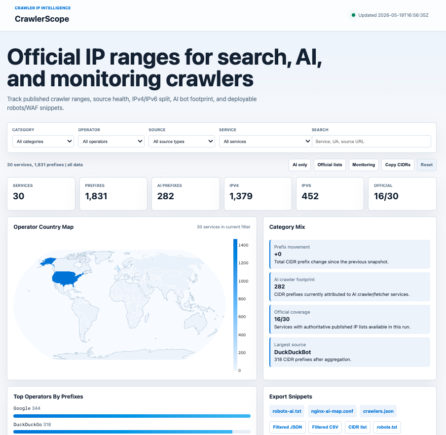

# CrawlerScope


<p align="center">
  <a href="LICENSE">
    
  </a>
  <a href="https://github.com/ipanalytics/CrawlerScope/actions">
    
  </a>
  <a href="https://ipanalytics.github.io/CrawlerScope/">
    
  </a>
  <a href="https://github.com/ipanalytics/CrawlerScope">
    
  </a>
  <a href="https://github.com/ipanalytics/CrawlerScope">
    
  </a>
  <a href="https://github.com/ipanalytics/CrawlerScope">
    
  </a>
</p>

---

CrawlerScope is a public crawler intelligence dataset and static GitHub Pages dashboard for crawler, AI bot, SEO bot, monitoring probe, and scanner infrastructure.

The project aggregates operator-published IP ranges, normalizes them into CIDR prefixes, tracks source provenance, and publishes operational exports for gateways, analytics pipelines, SIEM enrichment, bot management, and infrastructure visibility.

---

## Live Dashboard

### [https://ipanalytics.github.io/CrawlerScope/](https://ipanalytics.github.io/CrawlerScope/)

<p align="center">
  
</p>

Repository:

```text id="a8tv2u"
https://github.com/ipanalytics/CrawlerScope
```

---

## Overview

Crawler infrastructure is fragmented across vendor JSON feeds, documentation pages, robots specifications, and unofficial community-maintained lists.

CrawlerScope consolidates those sources into a normalized operational dataset with:

* CIDR normalization
* source attribution
* operator metadata
* category classification
* service labeling
* export tooling

The repository is designed for direct machine consumption and lightweight browser-based inspection.

---

## Current Coverage

### Search Crawlers

* Googlebot
* Bingbot
* DuckDuckGo
* Applebot
* YandexBot
* Baiduspider

### AI Crawlers and Fetchers

* OpenAI
* Anthropic
* Perplexity
* Meta
* Amazonbot
* Bytespider

### SEO Crawlers

* AhrefsBot
* SemrushBot

### Security Scanners

* Shodan
* Censys

### Monitoring Probes

* Datadog Synthetics
* Pingdom
* UptimeRobot
* Better Stack
* StatusCake

### Archive and Social Crawlers

* Common Crawl
* Pinterestbot
* LinkedInBot

---

## Source Trust Model

CrawlerScope separates datasets by source quality and publication model.

| Source Type             | Description                                                          |
| ----------------------- | -------------------------------------------------------------------- |
| `official_json`         | Operator-published structured JSON                                   |
| `official_text`         | Operator-published text-based CIDR lists                             |
| `documented_user_agent` | Publicly documented crawler identity without authoritative IP feed   |
| `known_static`          | Operationally useful static ranges with limited authority guarantees |

This distinction is preserved in exports and dashboard filters.

---

## Dashboard Features

| Feature            | Description                                           |
| ------------------ | ----------------------------------------------------- |
| Interactive map    | Country-level operator distribution                   |
| Category analytics | Operator/category mix charts                          |
| Cascading filters  | Filter by category, operator, source type, or service |
| Full-text search   | Search across operators, tags, URLs, and user-agents  |
| Export generation  | JSON, CSV, CIDR text, robots.txt, NGINX maps          |
| Presets            | AI crawlers, monitoring probes, official feeds        |
| Service table      | Sortable infrastructure inventory                     |
| Clipboard export   | Copy filtered CIDR selections                         |

---

## Architecture

```text id="2ab1o5"
              Public Sources
                     │
      ┌──────────────┼──────────────┐
      │              │              │
      ▼              ▼              ▼
 Vendor JSON     Documentation    Static Lists
      │              │              │
      └──────────────┴──────┬───────┘
                             ▼
                    Normalization Layer
                    CIDR + metadata merge
                             ▼
                    Classification Engine
                 category / tags / source type
                             ▼
                      Export Pipeline
             JSON / CSV / robots / nginx
                             ▼
                     Static Dashboard
```

---

## Published Outputs

| File                             | Description                         |
| -------------------------------- | ----------------------------------- |
| `data/current/crawlers.json`     | Full normalized crawler dataset     |
| `data/current/robots-ai.txt`     | robots.txt snippets for AI crawlers |
| `data/current/nginx-ai-map.conf` | NGINX user-agent mapping            |
| `data/history/summary.csv`       | Historical build metrics            |
| `data/snapshots/*.json`          | Compact snapshot summaries          |

---

## Export Examples

### Download current dataset

```bash id="2p0g9o"
curl -fsSLO \
  https://raw.githubusercontent.com/ipanalytics/CrawlerScope/main/data/current/crawlers.json
```

### Extract AI crawler ranges

```bash id="f3z0m6"
jq -r '
  .records[]
  | select(.category=="ai-crawler")
  | .prefix
' crawlers.json
```

### Generate robots rules

```bash id="pm0m5r"
curl -fsSL \
  https://raw.githubusercontent.com/ipanalytics/CrawlerScope/main/data/current/robots-ai.txt
```

### Use exported NGINX map

```nginx id="rzs2oe"
include /etc/nginx/nginx-ai-map.conf;

if ($is_ai_crawler = 1) {
    return 403;
}
```

---

## Repository Layout

```text id="5fjlwm"
CrawlerScope/
├── .github/
│   └── workflows/
├── data/
│   ├── current/
│   ├── history/
│   └── snapshots/
├── public/
│   ├── assets/
│   └── index.html
├── scripts/
├── LICENSE
└── README.md
```

Generated `site/` artifacts are intentionally excluded from version control.

---

## Local Development

### Update datasets

```bash id="wxmohm"
python3 scripts/update.py
```

### Local preview

```bash id="e6bwxr"
rm -rf site

cp -R public site
cp -R data site/data

python3 -m http.server 8080 --directory site
```

Open:

```text id="2qjlwm"
http://127.0.0.1:8080/
```

---

## GitHub Pages Deployment

CrawlerScope is deployed through GitHub Actions.

Workflow:

```text id="vf0o5n"
.github/workflows/crawler-scope.yml
```

Pages configuration:

* Source: `GitHub Actions`
* Branch deployment is not required
* Generated assets are published from workflow artifacts

---

## Update Schedule

Default refresh interval:

```yaml id="7wl9nq"
schedule:
  - cron: "23 */6 * * *"
```

Most upstream crawler sources update daily or less frequently, so sub-hour refresh intervals generally provide limited value.

---

## Operational Notes

* IP inventories are only as complete as upstream disclosures
* User-Agent strings are trivially spoofable
* Some operators publish crawler identities without stable IP feeds
* Static/public ranges should be treated as operational hints, not authoritative truth
* Multiple services may legitimately share infrastructure prefixes

---

## Use Cases

| Domain          | Example                                   |
| --------------- | ----------------------------------------- |
| Bot Management  | AI crawler detection and filtering        |
| SIEM Enrichment | Infrastructure attribution                |
| Analytics       | Search and crawler traffic classification |
| WAF Pipelines   | Allow/block automation logic              |
| SEO Monitoring  | Search crawler visibility                 |
| Threat Hunting  | Scanner infrastructure correlation        |

---

## Roadmap

Planned additions:

* ASN-level crawler attribution
* Historical prefix diffing
* Provider overlap analysis
* Signed dataset releases
* Compressed bulk exports
* Additional crawler verification metadata

---

## License

Licensed under CC0-1.0.

See [`LICENSE`](./LICENSE).

---

## Disclaimer

CrawlerScope aggregates publicly available infrastructure information for operational and analytical use. Consumers are responsible for validating suitability within their own environments.
