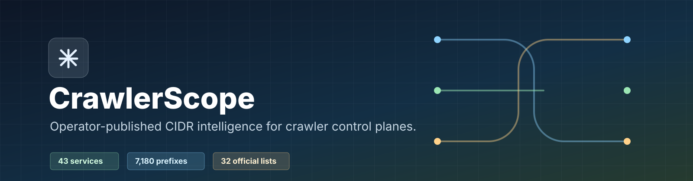
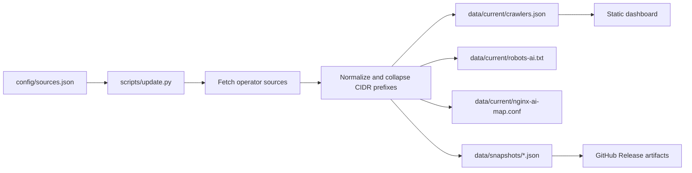

# CrawlerScope

<p align="center">
  
</p>

<p align="center">
  <a href="https://github.com/ipanalytics/CrawlerScope/actions/workflows/crawler-scope.yml"></a>
  <a href="https://ipanalytics.github.io/CrawlerScope/"></a>
  <a href="./LICENSE"></a>
  
  
  
</p>

CrawlerScope collects operator-published crawler, fetcher, monitoring, scanner, and preview-bot network ranges, normalizes them into deployable CIDR data, and publishes a static dashboard plus machine-readable artifacts for infrastructure and security teams.

**Live dashboard:** [ipanalytics.github.io/CrawlerScope](https://ipanalytics.github.io/CrawlerScope/)  
**Current dataset:** [data/current/crawlers.json](./data/current/crawlers.json)

---

## Overview

CrawlerScope is a small, auditable data pipeline for bot network intelligence. It tracks published source health, separates authoritative IP feeds from documented user-agent-only identities, and emits artifacts suitable for WAF rules, reverse proxies, allowlists, deny controls, analytics enrichment, and incident triage.

The project intentionally keeps source definitions in data, not code. Collector behavior lives in [`scripts/update.py`](./scripts/update.py); operator sources live in [`config/sources.json`](./config/sources.json).

## Current Dataset

Generated at `2026-05-26T12:01:22Z`.

| Metric | Count |
|---|---:|
| Services | 43 |
| Healthy sources | 43 |
| Authoritative IP lists | 32 |
| CIDR prefixes | 7,180 |
| IPv4 prefixes | 6,705 |
| IPv6 prefixes | 475 |
| AI crawler/fetcher prefixes | 1,653 |

| Category | Services |
|---|---:|
| AI crawlers | 13 |
| Search crawlers | 9 |
| Monitoring probes | 5 |
| Social previews | 4 |
| Fetchers | 3 |
| SEO crawlers | 3 |
| Ad verification | 2 |
| Security scanners | 2 |
| Archive | 1 |
| Analytics crawlers | 1 |

<details>
<summary>Tracked services</summary>

| Service | Category | Source type | Prefixes |
|---|---|---|---:|
| Google common crawlers | search | official_json | 69 |
| Google special crawlers | search | official_json | 46 |
| Google user-triggered fetchers | fetcher | official_json | 223 |
| Bingbot | search | official_json | 28 |
| DuckDuckBot | search | official_json | 334 |
| DuckAssistBot | ai | official_json | 334 |
| Applebot | search | official_json | 12 |
| MojeekBot | search | official_json | 1 |
| Naver Yeti | search | official_json | 36 |
| YandexBot | search | known_static | 13 |
| Baiduspider | search | known_static | 2 |
| GPTBot | ai | official_json | 17 |
| OAI-SearchBot | ai | official_json | 32 |
| ChatGPT-User | ai | official_json | 214 |
| OAI-AdsBot | ai | documented_user_agent | 0 |
| PerplexityBot | ai | official_json | 8 |
| Perplexity-User | ai | official_json | 4 |
| ClaudeBot / Claude-SearchBot | ai | documented_user_agent | 0 |
| Amazonbot | ai | official_embedded_json | 524 |
| Amzn-SearchBot | ai | official_embedded_json | 512 |
| Amzn-User | fetcher | official_embedded_json | 1,023 |
| Meta-ExternalAgent / Meta-WebIndexer | ai | known_static | 4 |
| Bytespider | ai | documented_user_agent | 0 |
| MistralAI-User | ai | official_json | 4 |
| AhrefsBot | seo | official_json | 51 |
| Lumar crawler | seo | official_json | 66 |
| SemrushBot | seo | documented_user_agent | 0 |
| Censys scanners | security-scanner | known_static | 2 |
| Shodan scanners | security-scanner | known_static | 9 |
| Datadog Synthetics | monitoring | official_json | 113 |
| IAS crawler | ad-verification | official_json | 14 |
| TTD-Content crawler | ad-verification | official_text | 2,615 |
| UptimeRobot | monitoring | official_text | 217 |
| Pingdom probes | monitoring | official_text | 158 |
| StatusCake probes | monitoring | official_json | 296 |
| Better Stack probes | monitoring | official_text | 34 |
| Common Crawl CCBot | archive | official_json | 6 |
| Flipboard crawler | social | official_text | 136 |
| Parse.ly crawler | analytics | official_json | 10 |
| Pinterestbot | social | documented_user_agent | 0 |
| LinkedInBot | social | documented_user_agent | 0 |
| Telegram link preview | social | official_text | 11 |
| RSS API feed parser | fetcher | official_text | 2 |

</details>

---

## Architecture

CrawlerScope runs as a scheduled GitHub Actions collector and publishes static artifacts.



Source types:

| Type | Meaning |
|---|---|
| `official_json` | Operator-published machine-readable JSON feed |
| `official_text` | Operator-published plain-text CIDR/IP feed |
| `official_embedded_json` | Operator page with machine-readable ranges embedded in HTML |
| `documented_user_agent` | Documented bot identity without a stable public IP list |
| `known_static` | Useful static seed list, not treated as complete authority |

## Features

- Operator-published source collection with source health tracking.
- IPv4/IPv6 normalization, CIDR coercion, and prefix collapsing.
- Static dashboard with category, operator, source, service, and search filters.
- Filtered exports for JSON, CSV, CIDR lists, `robots.txt`, and Nginx user-agent maps.
- Snapshot retention and historical summary tracking.
- GitHub Pages publication and automatic dataset releases.
- Config-driven source inventory in [`config/sources.json`](./config/sources.json).

## Quick Start

Run the collector and serve the dashboard locally:

```bash
python3 scripts/update.py
python3 -m http.server 8080
```

Open:

```text
http://127.0.0.1:8080/public/
```

When serving from `public/`, the app reads data from `../data/current`. For GitHub Pages deployment, the workflow copies `public/` and `data/` into the Pages artifact.

## Installation

CrawlerScope has no runtime dependency outside the Python standard library for data collection.

```bash
git clone https://github.com/ipanalytics/CrawlerScope.git
cd CrawlerScope
python3 scripts/update.py
```

Optional environment controls:

```bash
export CRAWLER_SCOPE_USER_AGENT="CrawlerScope/0.1 (+https://example.org/contact)"
export CRAWLER_SCOPE_SNAPSHOT_RETENTION=168
export CRAWLER_SCOPE_HISTORY_RETENTION=720
python3 scripts/update.py
```

## Usage Examples

Export all current CIDRs:

```bash
jq -r '.services[].prefixes | .ipv4[], .ipv6[]' data/current/crawlers.json
```

Export AI crawler CIDRs:

```bash
jq -r '.services[] | select(.category == "ai") | .prefixes | .ipv4[], .ipv6[]' data/current/crawlers.json
```

List sources that are documented but do not publish IP ranges:

```bash
jq -r '.services[] | select(.sourceType == "documented_user_agent") | [.id, .service, .sourceUrl] | @tsv' data/current/crawlers.json
```

Generate an Nginx include from the current dataset:

```bash
cp data/current/nginx-ai-map.conf /etc/nginx/conf.d/crawler-scope-ai-map.conf
nginx -t
```

## Outputs

| Path | Description |
|---|---|
| [`data/current/crawlers.json`](./data/current/crawlers.json) | Full normalized dataset |
| [`data/current/robots-ai.txt`](./data/current/robots-ai.txt) | Generated AI crawler `robots.txt` block |
| [`data/current/nginx-ai-map.conf`](./data/current/nginx-ai-map.conf) | Nginx `map` for AI crawler user-agents |
| [`data/history/summary.csv`](./data/history/summary.csv) | Historical summary rows |
| [`data/snapshots/*.json`](./data/snapshots) | Timestamped dataset snapshots |
| [`config/sources.json`](./config/sources.json) | Source inventory and classification config |

## Data Format

Each service record includes source metadata, user-agent patterns, reverse-DNS hints, health status, prefix counts, and split IPv4/IPv6 arrays.

```json
{
  "id": "openai-gptbot",
  "service": "GPTBot",
  "operator": "OpenAI",
  "category": "ai",
  "sourceType": "official_json",
  "sourceOk": true,
  "ipListAuthoritative": true,
  "userAgentPatterns": ["GPTBot"],
  "counts": {
    "prefixes": 17,
    "ipv4": 17,
    "ipv6": 0
  },
  "prefixes": {
    "ipv4": ["20.42.10.176/28"],
    "ipv6": []
  }
}
```

## Operational Notes

- Treat `sourceOk=false` as a collection failure for that run. The collector falls back to the previous cached prefixes when available.
- IP ranges identify published infrastructure, not intent. Use user-agent, reverse DNS, request behavior, and application context where enforcement risk matters.
- Static and documented-only sources are included because they are operationally useful, but authoritative flags remain separate.
- Release artifacts are generated by GitHub Actions after collection and attached to timestamped dataset releases.

## Project Scope

CrawlerScope tracks public crawler, fetcher, monitoring, scanner, analytics, and preview-bot infrastructure that is useful for request classification and network policy. It prioritizes primary operator-published sources. Aggregator repositories may be reviewed for discovery, but their URLs are not used as dataset sources.

## Use Cases

- WAF allow/deny policy design for crawler traffic.
- Search and AI crawler visibility audits.
- Security logging enrichment and bot attribution.
- Monitoring probe allowlisting.
- Fraud/risk triage for automated traffic.
- Change tracking for published crawler infrastructure.

## Limitations

- Some operators publish user-agent documentation but no stable IP feed.
- Cloud-hosted crawlers may share network space with unrelated workloads.
- CIDR lists can change without notice; scheduled collection reduces but does not remove that latency.

## Directory Structure

```text
.
├── config/
│   └── sources.json
├── data/
│   ├── current/
│   ├── history/
│   └── snapshots/
├── public/
│   ├── assets/
│   └── index.html
├── scripts/
│   └── update.py
└── .github/
    └── workflows/
```

## Deployment

The included workflow runs every six hours and can be triggered manually:

```yaml
on:
  schedule:
    - cron: "23 */6 * * *"
  workflow_dispatch:
```

The workflow:

1. Runs `scripts/update.py`.
2. Commits updated `data/` and `config/` changes.
3. Publishes a timestamped GitHub Release with dataset artifacts.
4. Deploys the static dashboard to GitHub Pages.

## License

CrawlerScope is released under the [MIT License](./LICENSE).

## Disclaimer

CrawlerScope publishes normalized data from public operator sources. Review upstream terms and validate enforcement logic before using the dataset in production controls.
