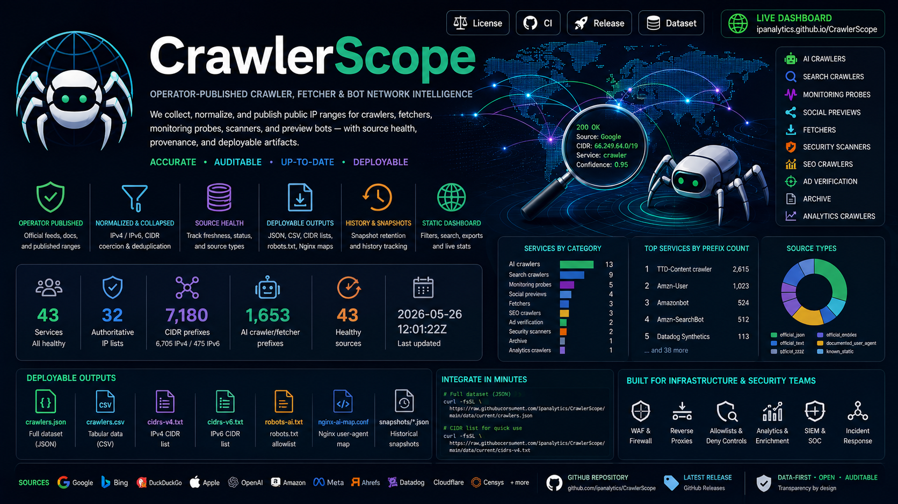
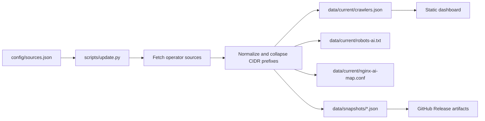

_English version: [README.md](README.md)_

# CrawlerScope

<p align="center">
  
</p>

<p align="center">
  <a href="https://github.com/ipanalytics/CrawlerScope/actions/workflows/crawler-scope.yml"></a>
  <a href="https://ipanalytics.github.io/CrawlerScope/"></a>
  <a href="./LICENSE"></a>
  
  
  
</p>

CrawlerScope собирает публикуемые операторами сетевые диапазоны краулеров, фетчеров, инструментов мониторинга, сканеров и preview-ботов, нормализует их в готовые к развёртыванию CIDR-данные и публикует статический дашборд, а также машиночитаемые артефакты для команд инфраструктуры и безопасности.

**Онлайн-дашборд:** [ipanalytics.github.io/CrawlerScope](https://ipanalytics.github.io/CrawlerScope/)  
**Текущий набор данных:** [data/current/crawlers.json](./data/current/crawlers.json)

---

## Обзор

CrawlerScope — это небольшой, поддающийся аудиту конвейер данных для аналитики бот-сетей. Он отслеживает состояние опубликованных источников, отделяет авторитетные IP-фиды от задокументированных идентификаторов, известных только по user-agent, и формирует артефакты, пригодные для правил WAF, обратных прокси, списков разрешений (allowlist), механизмов блокировки, обогащения аналитики и первичной обработки (triage) инцидентов.

Проект намеренно хранит определения источников в данных, а не в коде. Логика коллектора находится в [`scripts/update.py`](./scripts/update.py); источники операторов — в [`config/sources.json`](./config/sources.json).

## Текущий набор данных

Сгенерировано `2026-05-26T12:01:22Z`.

| Показатель | Количество |
|---|---:|
| Сервисы | 43 |
| Работоспособные источники | 43 |
| Авторитетные IP-списки | 32 |
| CIDR-префиксы | 7 180 |
| IPv4-префиксы | 6 705 |
| IPv6-префиксы | 475 |
| Префиксы ИИ-краулеров/фетчеров | 1 653 |

| Категория | Сервисы |
|---|---:|
| ИИ-краулеры | 13 |
| Поисковые краулеры | 9 |
| Зонды мониторинга | 5 |
| Социальные превью | 4 |
| Фетчеры | 3 |
| SEO-краулеры | 3 |
| Проверка рекламы | 2 |
| Сканеры безопасности | 2 |
| Архив | 1 |
| Аналитические краулеры | 1 |

<details>
<summary>Отслеживаемые сервисы</summary>

| Сервис | Категория | Тип источника | Префиксы |
|---|---|---|---:|
| Google common crawlers | search | official_json | 69 |
| Google special crawlers | search | official_json | 46 |
| Google user-triggered fetchers | fetcher | official_json | 223 |
| Bingbot | search | official_json | 28 |
| DuckDuckBot | search | official_json | 334 |
| DuckAssistBot | ai | official_json | 334 |
| Applebot | search | official_json | 12 |
| MojeekBot | search | official_json | 1 |
| Naver Yeti | search | official_json | 36 |
| YandexBot | search | known_static | 13 |
| Baiduspider | search | known_static | 2 |
| GPTBot | ai | official_json | 17 |
| OAI-SearchBot | ai | official_json | 32 |
| ChatGPT-User | ai | official_json | 214 |
| OAI-AdsBot | ai | documented_user_agent | 0 |
| PerplexityBot | ai | official_json | 8 |
| Perplexity-User | ai | official_json | 4 |
| ClaudeBot / Claude-SearchBot | ai | documented_user_agent | 0 |
| Amazonbot | ai | official_embedded_json | 524 |
| Amzn-SearchBot | ai | official_embedded_json | 512 |
| Amzn-User | fetcher | official_embedded_json | 1 023 |
| Meta-ExternalAgent / Meta-WebIndexer | ai | known_static | 4 |
| Bytespider | ai | documented_user_agent | 0 |
| MistralAI-User | ai | official_json | 4 |
| AhrefsBot | seo | official_json | 51 |
| Lumar crawler | seo | official_json | 66 |
| SemrushBot | seo | documented_user_agent | 0 |
| Censys scanners | security-scanner | known_static | 2 |
| Shodan scanners | security-scanner | known_static | 9 |
| Datadog Synthetics | monitoring | official_json | 113 |
| IAS crawler | ad-verification | official_json | 14 |
| TTD-Content crawler | ad-verification | official_text | 2 615 |
| UptimeRobot | monitoring | official_text | 217 |
| Pingdom probes | monitoring | official_text | 158 |
| StatusCake probes | monitoring | official_json | 296 |
| Better Stack probes | monitoring | official_text | 34 |
| Common Crawl CCBot | archive | official_json | 6 |
| Flipboard crawler | social | official_text | 136 |
| Parse.ly crawler | analytics | official_json | 10 |
| Pinterestbot | social | documented_user_agent | 0 |
| LinkedInBot | social | documented_user_agent | 0 |
| Telegram link preview | social | official_text | 11 |
| RSS API feed parser | fetcher | official_text | 2 |

</details>

---

## Архитектура

CrawlerScope работает как коллектор на базе GitHub Actions, запускаемый по расписанию, и публикует статические артефакты.



Типы источников:

| Тип | Значение |
|---|---|
| `official_json` | Публикуемый оператором машиночитаемый JSON-фид |
| `official_text` | Публикуемый оператором фид CIDR/IP в виде обычного текста |
| `official_embedded_json` | Страница оператора с машиночитаемыми диапазонами, встроенными в HTML |
| `documented_user_agent` | Задокументированная идентификация бота без стабильного публичного списка IP |
| `known_static` | Полезный статический seed-список, не считающийся полным авторитетным источником |

## Возможности

- Сбор источников, публикуемых операторами, с отслеживанием работоспособности источников.
- Нормализация IPv4/IPv6, приведение к CIDR и схлопывание префиксов.
- Статическая информационная панель (dashboard) с фильтрами по категории, оператору, источнику, сервису и поиском.
- Экспорт с фильтрацией в JSON, CSV, списки CIDR, `robots.txt` и карты user-agent Nginx.
- Хранение снимков (snapshot) и отслеживание исторических сводок.
- Публикация на GitHub Pages и автоматические релизы наборов данных.
- Определяемый конфигурацией реестр источников в [`config/sources.json`](./config/sources.json).

## Быстрый старт

Запустите сборщик и локальный сервер информационной панели:

```bash
python3 scripts/update.py
python3 -m http.server 8080
```

Откройте:

```text
http://127.0.0.1:8080/public/
```

При обслуживании из `public/` приложение читает данные из `../data/current`. При развёртывании на GitHub Pages workflow копирует `public/` и `data/` в артефакт Pages.

## Установка

Для сбора данных CrawlerScope не имеет зависимостей во время выполнения за пределами стандартной библиотеки Python.

```bash
git clone https://github.com/ipanalytics/CrawlerScope.git
cd CrawlerScope
python3 scripts/update.py
```

Необязательные переменные окружения:

```bash
export CRAWLER_SCOPE_USER_AGENT="CrawlerScope/0.1 (+https://example.org/contact)"
export CRAWLER_SCOPE_SNAPSHOT_RETENTION=168
export CRAWLER_SCOPE_HISTORY_RETENTION=720
python3 scripts/update.py
```

## Примеры использования

Экспорт всех текущих CIDR:

```bash
jq -r '.services[].prefixes | .ipv4[], .ipv6[]' data/current/crawlers.json
```

Экспорт CIDR ИИ-краулеров:

```bash
jq -r '.services[] | select(.category == "ai") | .prefixes | .ipv4[], .ipv6[]' data/current/crawlers.json
```

Вывод списка источников, которые задокументированы, но не публикуют диапазоны IP:

```bash
jq -r '.services[] | select(.sourceType == "documented_user_agent") | [.id, .service, .sourceUrl] | @tsv' data/current/crawlers.json
```

Формирование Nginx include из текущего набора данных:

```bash
cp data/current/nginx-ai-map.conf /etc/nginx/conf.d/crawler-scope-ai-map.conf
nginx -t
```

## Выходные файлы

| Путь | Описание |
|---|---|
| [`data/current/crawlers.json`](./data/current/crawlers.json) | Полный нормализованный набор данных |
| [`data/current/robots-ai.txt`](./data/current/robots-ai.txt) | Сгенерированный блок `robots.txt` для ИИ-краулеров |
| [`data/current/nginx-ai-map.conf`](./data/current/nginx-ai-map.conf) | Nginx `map` для user-agent ИИ-краулеров |
| [`data/history/summary.csv`](./data/history/summary.csv) | Строки исторических сводок |
| [`data/snapshots/*.json`](./data/snapshots) | Снимки набора данных с метками времени |
| [`config/sources.json`](./config/sources.json) | Конфигурация реестра источников и их классификации |

## Формат данных

Каждая запись сервиса включает метаданные источника, шаблоны user-agent, подсказки reverse-DNS, статус работоспособности, количество префиксов и разделённые массивы IPv4/IPv6.

```json
{
  "id": "openai-gptbot",
  "service": "GPTBot",
  "operator": "OpenAI",
  "category": "ai",
  "sourceType": "official_json",
  "sourceOk": true,
  "ipListAuthoritative": true,
  "userAgentPatterns": ["GPTBot"],
  "counts": {
    "prefixes": 17,
    "ipv4": 17,
    "ipv6": 0
  },
  "prefixes": {
    "ipv4": ["20.42.10.176/28"],
    "ipv6": []
  }
}
```

## Эксплуатационные примечания

- Считайте `sourceOk=false` сбоем сбора за соответствующий запуск. При наличии сборщик откатывается к предыдущим кэшированным префиксам.
- Диапазоны IP идентифицируют опубликованную инфраструктуру, а не намерения. Там, где важен риск, связанный с применением мер (enforcement), используйте user-agent, reverse DNS, поведение запросов и контекст приложения.
- Статические источники и источники, представленные только документацией, включены, поскольку они полезны на практике, однако флаги авторитетности остаются отдельными.
- Артефакты релизов генерируются GitHub Actions после сбора и прикрепляются к релизам наборов данных с метками времени.

## Охват проекта

CrawlerScope отслеживает инфраструктуру публичных краулеров, загрузчиков, систем мониторинга, сканеров, средств аналитики и preview-ботов, полезную для классификации запросов и сетевой политики. Приоритет отдаётся первичным источникам, публикуемым операторами. Репозитории-агрегаторы могут просматриваться для обнаружения источников, но их URL не используются в качестве источников набора данных.

## Варианты использования

- Проектирование политик разрешения/блокировки WAF для трафика краулеров.
- Аудиты видимости для поисковых и AI-краулеров.
- Обогащение журналов безопасности и атрибуция ботов.
- Добавление зондов мониторинга в белые списки.
- Триаж мошенничества/рисков для автоматизированного трафика.
- Отслеживание изменений опубликованной инфраструктуры краулеров.

## Ограничения

- Некоторые операторы публикуют документацию по user-agent, но не предоставляют стабильного источника IP-адресов.
- Краулеры, размещённые в облаке, могут использовать сетевое пространство совместно с несвязанными рабочими нагрузками.
- Списки CIDR могут изменяться без уведомления; сбор по расписанию уменьшает, но не устраняет эту задержку.

## Структура каталогов

```text
.
├── config/
│   └── sources.json
├── data/
│   ├── current/
│   ├── history/
│   └── snapshots/
├── public/
│   ├── assets/
│   └── index.html
├── scripts/
│   └── update.py
└── .github/
    └── workflows/
```

## Развёртывание

Входящий в состав workflow выполняется каждые шесть часов и может быть запущен вручную:

```yaml
on:
  schedule:
    - cron: "23 */6 * * *"
  workflow_dispatch:
```

Workflow:

1. Запускает `scripts/update.py`.
2. Коммитит обновлённые изменения в `data/` и `config/`.
3. Публикует GitHub Release с меткой времени, содержащий артефакты набора данных.
4. Разворачивает статический дашборд на GitHub Pages.

## Лицензия

CrawlerScope распространяется под лицензией [MIT License](./LICENSE).

## Отказ от ответственности

CrawlerScope публикует нормализованные данные из общедоступных источников операторов. Перед использованием набора данных в производственных механизмах контроля ознакомьтесь с условиями первичных источников (upstream) и проверьте логику применения.
